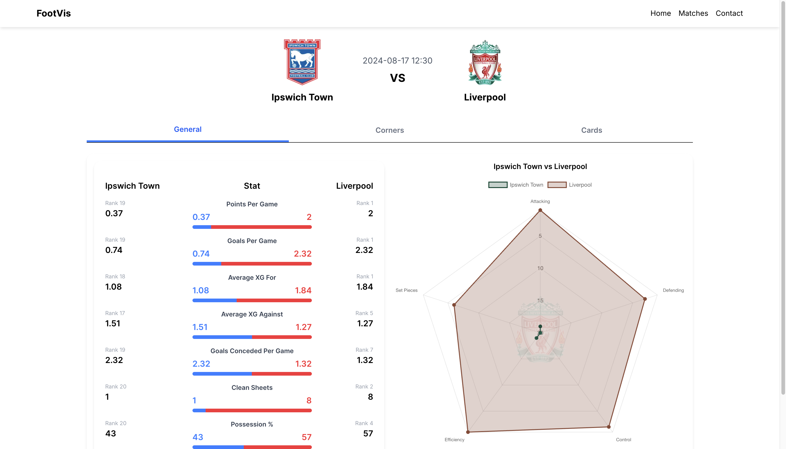

# Football Analysis Platform
Football Analysis Platform (no name as of yet) is a platform created to challenge how football analysis is traditionally conducted. It aggregates data from multiple sources to provide deeper insights into team performance, player statistics, and tactical trends.

The idea came from the lack of publicly available football statistics that are clean, simple, and concise for data-driven football enthusiasts. Unlike many existing football sites, which often overwhelm users with cluttered data, inconsistent metrics, or incomplete statistics, this platform focuses on clarity, consistency, and actionable insights. It aggregates reliable data, presents it in an intuitive format, and highlights key performance indicators, making it easy to analyze teams, compare players, and understand the game from a data-driven perspective. So, whether you are a fellow football fan, a friend, or someone reviewing my CV, take a look.

The main aim is to get it fully online before the end of the year and keep developing. Any feedback for those who can get it up and running would be great!

## Preview
For those who can't get it running or just trying to get a general look at the website, photos are provided here:

